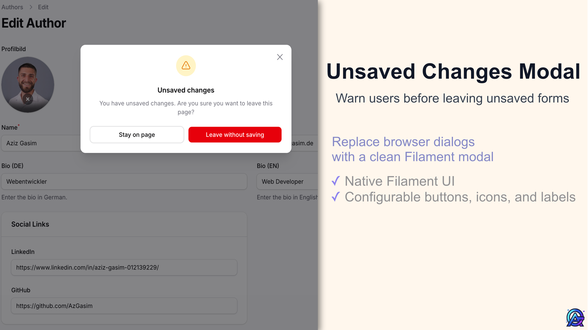
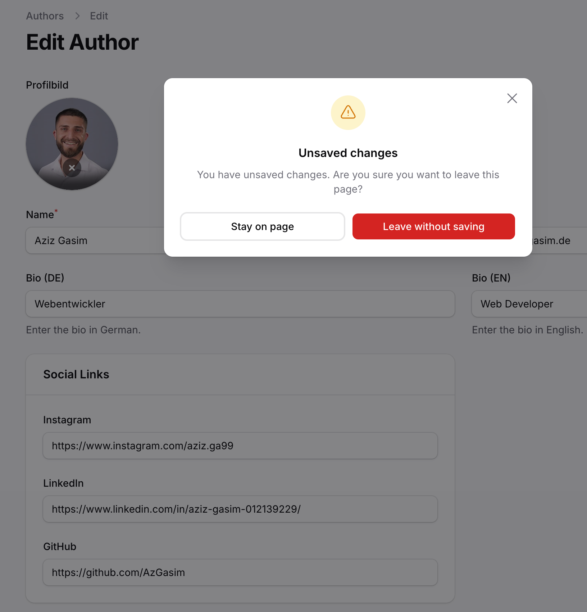

# Filament Unsaved Changes Modal

[](https://packagist.org/packages/azgasim/filament-unsaved-changes-modal)
[](https://packagist.org/packages/azgasim/filament-unsaved-changes-modal)
[](https://github.com/azgasim/filament-unsaved-changes-modal/actions/workflows/run-tests.yml)
[](https://github.com/azgasim/filament-unsaved-changes-modal/actions/workflows/fix-php-code-style-issues.yml)
[](LICENSE.md)

In the Filament panel, leaving a dirty form shows a **Filament modal**
instead of the browser’s blocking confirmation dialog.

Reloading or closing the tab still uses the native browser prompt
(which cannot be customized).



Works with **Filament SPA** (`livewire:navigate`) and **normal full-page** navigation (same-origin link clicks in the panel body). Uses the same dirty-state rules as Filament’s `[unsavedChangesAlerts()](https://filamentphp.com/docs/5.x/panel-configuration#unsaved-changes-alerts)`; this package only swaps the confirmation UI.

### Compatibility


| Plugin  | Filament   | PHP      |
| ------- | ---------- | -------- |
| **1.x** | **^5.3.5** | **^8.2** |


Requires **Filament 5.3.5+** due to a known XSS vulnerability ([CVE-2026-33080](https://github.com/filamentphp/filament/security/advisories/GHSA-vv3x-j2x5-36jc)) in earlier versions.

## Installation

```bash
composer require azgasim/filament-unsaved-changes-modal
```

Laravel auto-discovers the package service provider.

## Usage

You need **both** `unsavedChangesAlerts()` and this plugin on the same panel.

**In your panel provider** (e.g. `AdminPanelProvider::panel()` — keep your existing `->path()`, `->login()`, middleware, etc.):

```php
use AzGasim\FilamentUnsavedChangesModal\FilamentUnsavedChangesModalPlugin;

return $panel
    // … your existing panel configuration …
    ->unsavedChangesAlerts()
    ->plugin(FilamentUnsavedChangesModalPlugin::make());
```

You can also register the plugin inside `->plugins([...])` with your other plugins.

## Customization

### Modal appearance

Defaults live on `[FilamentUnsavedChangesModalPlugin](src/FilamentUnsavedChangesModalPlugin.php)`: `DEFAULT_MODAL_WIDTH`, `DEFAULT_MODAL_ICON_COLOR`, `DEFAULT_STAY_BUTTON_COLOR`, `DEFAULT_LEAVE_BUTTON_COLOR`, and an icon default of `OutlinedExclamationTriangle` when you do not call `modalIcon()`.

```php
FilamentUnsavedChangesModalPlugin::make()
    ->modalWidth('xl')
    ->modalIcon('OutlinedExclamationTriangle')
    ->modalIconColor('danger')
    ->stayButtonColor('gray')
    ->leaveButtonColor('warning')
```


| Method                                                        | Values                                                                                                                                                                                                                                                                     |
| ------------------------------------------------------------- | -------------------------------------------------------------------------------------------------------------------------------------------------------------------------------------------------------------------------------------------------------------------------- |
| `modalWidth()`                                                | `xs`, `sm`, `md`, `lg`, `xl`, `2xl`, `3xl`, `4xl`, `5xl`, `6xl`, `7xl`, `full`, `min`, `max`, `fit`, `prose`, `screen-sm`, `screen-md`, `screen-lg`, `screen-xl`, `screen-2xl`, `screen` — same string values as Filament’s `Width` enum (`Filament\Support\Enums\Width`). |
| `modalIcon()`                                                 | `Heroicon::OutlinedExclamationTriangle` or `'OutlinedExclamationTriangle'` (not `o-exclamation-triangle`)                                                                                                                                                                  |
| `modalIconColor()`, `stayButtonColor()`, `leaveButtonColor()` | `primary`, `success`, `danger`, `warning`, `info`, `gray`, … (your panel color keys)                                                                                                                                                                                       |


There is **no** published config file; configure the plugin with the methods above.

### Translations

Keys: `filament-unsaved-changes-modal::unsaved-changes-modal.navigation.`* — see [English](resources/lang/en/unsaved-changes-modal.php) (and **German** `de` is shipped in the package).

```bash
php artisan vendor:publish --tag="filament-unsaved-changes-modal-translations"
```

### Views

Only if you want to change the Blade markup, copy the package views into your app:

```bash
php artisan vendor:publish --tag="filament-unsaved-changes-modal-views"
```

If you change the modal’s DOM `id` in a published view, keep it in sync with `[MODAL_DOM_ID](src/FilamentUnsavedChangesModalPlugin.php)` and the [script hook view](resources/views/hooks/unsaved-changes-script-overrides.blade.php) (the script opens and closes the modal by that `id`).

### Skipping the prompt for a link

Add `data-skip-unsaved-changes-modal` on the `<a>` **or on any ancestor element** (the listener uses `closest(...)`).

## Testing

```bash
composer test
```

## Changelog

[CHANGELOG.md](CHANGELOG.md)

## Contributing

[CONTRIBUTING.md](.github/CONTRIBUTING.md)

## Security

[SECURITY.md](.github/SECURITY.md)

## Credits

- [Aziz Gasim](https://github.com/AzGasim)
- [Contributors](https://github.com/azgasim/filament-unsaved-changes-modal/graphs/contributors)

## License

[MIT](LICENSE.md)